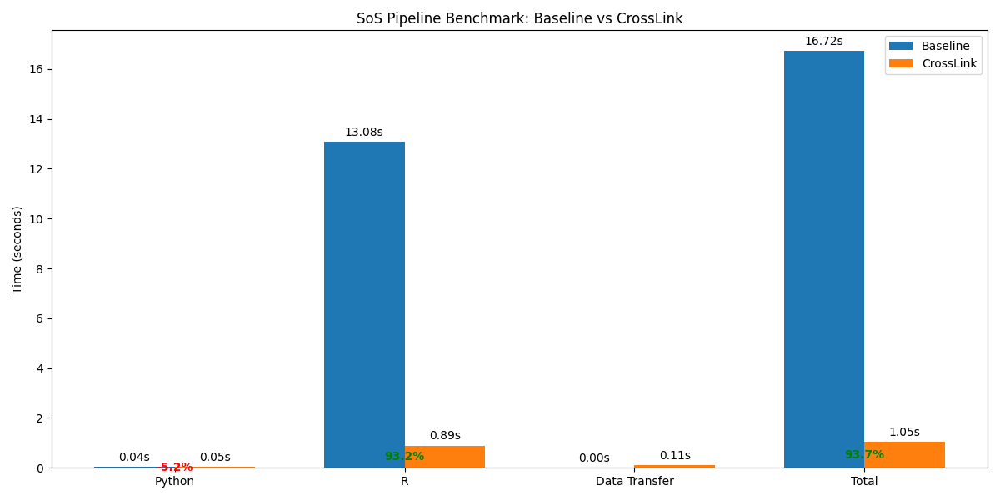
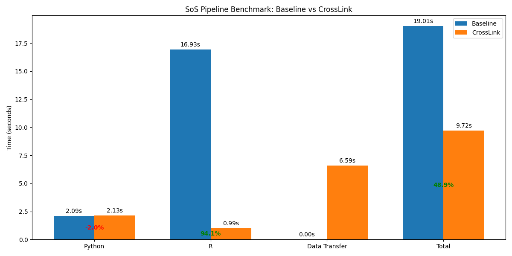

# CrossLink: Blazing-Fast Cross-Language Data Sharing 🚀

<div align="center">

  <!-- Placeholder logo - Consider creating a specific logo for CrossLink -->
  

  [](LICENSE)
  [](https://isocpp.org/)
  [](https://www.python.org/downloads/)
  [](https://www.r-project.org/)
  [](https://julialang.org/)

  **Stop copying, start sharing! Seamless, high-performance data sharing between C++, Python, R, and Julia using Apache Arrow and DuckDB.**

</div>

## The Problem: The Inter-Language Data Bottleneck

Modern data science and analytics pipelines often involve multiple programming languages. Python for data wrangling, R for statistical modeling, C++ for performance-critical computations. But how do you efficiently pass data between these different worlds?

Traditional methods like saving to CSV or even optimized formats like Parquet introduce significant overhead:

*   **Serialization/Deserialization:** Converting data to and from file formats takes time.
*   **I/O Operations:** Reading and writing to disk is slow.
*   **Data Duplication:** Each process often ends up with its own copy of the data in memory.

This bottleneck becomes increasingly painful as datasets grow larger.

## The Solution: CrossLink ⚡

**CrossLink** eliminates this bottleneck by enabling **direct, high-performance data sharing** between different language processes. It leverages:

*   💾 **Apache Arrow:** The standard for efficient in-memory columnar data representation.
*   🧠 **Shared Memory & Memory Mapping:** Zero-copy or minimal-copy data transfer mechanisms where possible.
*   🦆 **DuckDB:** For lightning-fast metadata management and optional SQL querying across shared datasets.

Think of it as creating a shared data pool where Python, R, C++, and Julia can access the *same* Arrow data structures in memory with minimal overhead.

## Benchmark Results: Seeing is Believing!

We benchmarked CrossLink against common data sharing patterns in a typical Python -> R pipeline using a **100 million row dataset**. The results speak for themselves:

### CrossLink vs. Traditional CSV

This compares CrossLink against the common practice of saving data as a CSV file in Python and reading it in R.


*Data: [benchmark_results_100thou.csv](benchmark_results_100thou.csv)*

**Key Takeaways:**

*   **~16x Faster Total Time:** CrossLink drastically reduces the overall pipeline time (1.05s vs 16.72s).
*   **Eliminates I/O Bottleneck:** The massive time spent by the baseline in reading/writing CSV is replaced by CrossLink's efficient transfer (~0.11s).
*   **Focus on Computation:** The actual processing time in Python and R becomes the dominant factor, not the data transfer.

### CrossLink vs. Optimized Arrow/Parquet (Disk-Based)

This compares CrossLink against a more optimized baseline that uses the efficient Arrow/Parquet file format for disk-based transfer between Python and R.


*Data: [benchmark_results_arrow.csv](benchmark_results_arrow.csv)*

**Key Takeaways:**

*   **~2x Faster Total Time:** Even compared to an optimized file-based Arrow workflow, CrossLink provides a significant speedup (9.72s vs 19.01s).
*   **Superior Transfer Speed:** CrossLink's direct memory sharing mechanism still outperforms reading/writing even optimized Parquet files for inter-process communication.

**Conclusion:** CrossLink offers substantial performance improvements over both traditional and optimized file-based data sharing methods, making cross-language data science workflows significantly faster and more efficient.

## 🏛️ Architecture

CrossLink combines several powerful technologies:

1.  **Core C++ Library (`libcrosslink`):** The heart of CrossLink, built with C++17. It uses Arrow C++ for data manipulation and DuckDB C++ for managing metadata about shared datasets (like names, schemas, and locations). It handles the low-level details of shared memory or memory-mapped file creation based on Arrow IPC format.
2.  **Language Bindings:** Thin C++ layers using tools like `pybind11` (Python), `Rcpp` (R), and `CxxWrap.jl` (Julia) to expose the core library's functions to each language.
3.  **Language Packages/Modules:** Idiomatic wrappers in Python, R, and Julia that provide a user-friendly API, calling the underlying bindings.

<div align="center">

```
   C++ Process 1 <──────┐                     ┌───────────────┐
        │               │ Zero-Copy / Arrow IPC │               │
        ▼               └─────────────────────▶│ CrossLink Core│
 Python Process 2 <──────┐ (Shared Memory Pool │ (C++/Arrow/   │
        │               │   or Memory Mapped  │    DuckDB)    │
        ▼               └─────────┬───────────▶│ (libcrosslink)│
     R Process 3 <──────┐         │           └───────┬───────┘
        │               │         │                   │ Metadata DB
        ▼               └─────────┼───────────────────▶ (e.g., .duckdb file)
  Julia Process 4 <─────┘         │
```

</div>

## ▶️ Usage Examples

*(Note: Ensure the CrossLink library and language-specific bindings are correctly built and installed/accessible.)*

### C++

```cpp
#include <crosslink/crosslink.h> // Assuming header installation
#include <arrow/api.h>
#include <arrow/table.h>
#include <iostream>
#include <vector>

// Helper function to create a sample Arrow Table
std::shared_ptr<arrow::Table> create_sample_table() {
    auto schema = arrow::schema({arrow::field("a", arrow::int64()), arrow::field("b", arrow::utf8())});
    arrow::Int64Builder int_builder;
    arrow::StringBuilder str_builder;
    ARROW_EXPECT_OK(int_builder.AppendValues({1, 2, 3, 4, 5}));
    ARROW_EXPECT_OK(str_builder.AppendValues({"alpha", "beta", "gamma", "delta", "epsilon"}));
    std::shared_ptr<arrow::Array> arr_a, arr_b;
    ARROW_EXPECT_OK(int_builder.Finish(&arr_a));
    ARROW_EXPECT_OK(str_builder.Finish(&arr_b));
    return arrow::Table::Make(schema, {arr_a, arr_b});
}

int main() {
    try {
        // 1. Initialize CrossLink (manages metadata in this DB file)
        crosslink::CrossLink cl("my_shared_data.duckdb");
        cl.set_debug(true); // Enable verbose logging

        // 2. Create some data
        std::shared_ptr<arrow::Table> my_table = create_sample_table();
        std::cout << "Original C++ Table:\n" << my_table->ToString() << std::endl;

        // 3. Push the table to the shared pool
        std::string dataset_name = "cpp_data_set";
        std::string dataset_id = cl.push(my_table, dataset_name, "Sample data generated in C++");
        std::cout << "\n[C++] Pushed table '" << dataset_id << "'" << std::endl;
        assert(dataset_id == dataset_name); // push returns the name if provided

        // 4. List available datasets
        auto datasets = cl.list_datasets();
        std::cout << "\n[C++] Available datasets:" << std::endl;
        for(const auto& id : datasets) {
            std::cout << " - " << id << std::endl;
        }

        // 5. Pull data (perhaps pushed by another language)
        std::string python_dataset_id = "python_data_set"; // Assume Python pushes this
        try {
             std::cout << "\n[C++] Attempting to pull '" << python_dataset_id << "'..." << std::endl;
             std::shared_ptr<arrow::Table> pulled_table = cl.pull(python_dataset_id);
             std::cout << "[C++] Pulled table '" << python_dataset_id << "':\n" << pulled_table->ToString() << std::endl;
        } catch (const std::exception& pull_err) {
             std::cerr << "[C++] Failed to pull '" << python_dataset_id << "': " << pull_err.what() << std::endl;
        }

        // 6. Query data using SQL (via DuckDB)
        std::cout << "\n[C++] Querying '" << dataset_id << "'..." << std::endl;
        auto query_result = cl.query("SELECT b, a * 10 AS a_mult FROM " + dataset_id + " WHERE a > 2 ORDER BY a DESC");
        std::cout << "[C++] Query Result:\n" << query_result->ToString() << std::endl;

        // 7. Cleanup (optional - releases resources if instance goes out of scope)
        // cl.cleanup(); // Or rely on destructor

    } catch (const std::exception& e) {
        std::cerr << "Error in C++ example: " << e.what() << std::endl;
        return 1;
    }
    return 0;
}
```

### Python

*Requires the Python package (`duckdata.crosslink`) to be installed, including the compiled C++ bindings.*

```python
import pyarrow as pa
import pandas as pd
import duckdata.crosslink as crosslink # Use the top-level package
import numpy as np
import os

DB_PATH = "my_shared_data.duckdb" # Same DB file as C++

try:
    # 1. Get a CrossLink instance (auto-detects C++ backend)
    # Ensures only one process modifies the DB schema at a time if needed
    cl = crosslink.get_instance(db_path=DB_PATH, debug=True)
    print("[Python] CrossLink instance acquired.")

    # 2. Create a sample PyArrow Table
    data = {
        'ticker': pa.array(['AAPL', 'GOOG', 'MSFT', 'AMZN'] * 2),
        'price': pa.array(np.random.rand(8) * 100 + 50),
        'volume': pa.array(np.random.randint(10000, 50000, size=8))
    }
    py_table = pa.table(data)
    print(f"\n[Python] Original Python Table:\n{py_table.to_pandas()}")

    # 3. Push the table
    dataset_name = "python_data_set"
    dataset_id = cl.push(py_table, name=dataset_name, description="Stock data from Python")
    print(f"\n[Python] Pushed table '{dataset_id}'")
    assert dataset_id == dataset_name

    # 4. List datasets
    datasets = cl.list_datasets()
    print(f"\n[Python] Available datasets: {datasets}")

    # 5. Pull data (e.g., the one pushed from C++)
    cpp_dataset_id = "cpp_data_set"
    try:
        print(f"\n[Python] Attempting to pull '{cpp_dataset_id}'...")
        pulled_cpp_table = cl.pull(cpp_dataset_id)
        if pulled_cpp_table:
             print(f"[Python] Pulled table '{cpp_dataset_id}':\n{pulled_cpp_table.to_pandas()}")
        else:
             print(f"[Python] Pull for '{cpp_dataset_id}' returned None.")
    except Exception as e:
        print(f"[Python] Failed to pull '{cpp_dataset_id}': {e}")
        # import traceback
        # traceback.print_exc() # Uncomment for detailed error

    # 6. Query data using SQL
    print(f"\n[Python] Querying '{dataset_name}'...")
    query = f"SELECT ticker, AVG(price) as avg_price, SUM(volume) as total_volume FROM {dataset_name} GROUP BY ticker ORDER BY ticker"
    query_result_table = cl.query(query) # Get Arrow Table
    print(f"[Python] Query Result:\n{query_result_table.to_pandas()}")

    # 7. Cleanup (important to release locks/resources)
    print("\n[Python] Cleaning up CrossLink instance...")
    cl.close() # Explicitly close the connection

except Exception as e:
    print(f"An error occurred in Python example: {e}")
    import traceback
    traceback.print_exc()
finally:
    # Ensure cleanup happens even on error if cl was initialized
    if 'cl' in locals() and cl is not None and hasattr(cl, 'close') and not cl.is_closed():
         print("[Python] Ensuring final cleanup in finally block...")
         cl.close()

```

### R

*Requires the `CrossLink` R package to be installed, including compiled C++ components.*

```R
# Ensure required packages are loaded
# install.packages("arrow") # If not already installed
# install.packages("CrossLink") # Assuming it's installable
library(arrow)
library(dplyr) # Optional, for data manipulation example
library(CrossLink) # Load the CrossLink package

DB_PATH <- "my_shared_data.duckdb" # Use the same DB file

# --- Error Handling Wrapper ---
tryCatch({

  # 1. Connect to CrossLink
  # Use the exported function from the package
  cl_con <- crosslink_connect(db_path = DB_PATH, debug = TRUE)
  print("[R] CrossLink connection established.")

  # 2. Create sample R data (e.g., a data.frame)
  r_df <- data.frame(
    patient_id = paste0("P", 101:110),
    measurement = rnorm(10, mean = 100, sd = 15),
    visit_date = seq(as.Date("2024-01-01"), by = "week", length.out = 10)
  )
  # Convert to Arrow Table for sharing
  r_table <- arrow_table(r_df)
  print("[R] Original R Table:")
  print(r_table)

  # 3. Push the table
  dataset_name <- "r_data_set"
  dataset_id <- crosslink_push(cl_con, r_table, name = dataset_name, description = "Patient data from R")
  print(paste0("[R] Pushed table '", dataset_id, "'"))
  stopifnot(dataset_id == dataset_name) # Verify returned ID

  # 4. List datasets
  datasets <- crosslink_list_datasets(cl_con)
  print("[R] Available datasets:")
  print(datasets)

  # 5. Pull data (e.g., from Python)
  python_dataset_id <- "python_data_set"
  print(paste0("[R] Attempting to pull '", python_dataset_id, "'..."))
  pulled_py_table <- crosslink_pull(cl_con, python_dataset_id) # Should return Arrow Table
  if (!is.null(pulled_py_table) && inherits(pulled_py_table, "Table")) {
    print(paste0("[R] Pulled table '", python_dataset_id, "':"))
    print(as.data.frame(pulled_py_table)) # Convert to R data.frame for display/use
  } else {
    print(paste0("[R] Failed to pull or received unexpected type for '", python_dataset_id, "'."))
  }

  # 6. Query data using SQL
  print(paste0("[R] Querying '", dataset_id, "'..."))
  query <- paste0("SELECT patient_id, measurement FROM ", dataset_id, " WHERE measurement > 90 ORDER BY visit_date")
  query_result_table <- crosslink_query(cl_con, query) # Should return Arrow Table
  print("[R] Query Result:")
  if (!is.null(query_result_table) && inherits(query_result_table, "Table")) {
      print(as.data.frame(query_result_table))
  } else {
      print("[R] Query returned NULL or unexpected type.")
  }

}, error = function(e) {
  # --- Error Reporting ---
  print(paste("An error occurred in R example:", e$message))
  # print(sys.calls()) # Uncomment for stack trace

}, finally = {
  # 7. Cleanup
  print("[R] Cleaning up CrossLink connection...")
  if (exists("cl_con") && !is.null(cl_con)) {
    # Use the correct cleanup function exported by the package
    crosslink_cleanup(cl_con)
    print("[R] Connection closed.")
  }
})

```

### Julia

*(Example TBD - Requires implementation and testing of Julia bindings using CxxWrap.jl)*

```julia
#=
using Arrow
using DataFrames # Or your preferred table manipulation library
# using CrossLink # Assuming a Julia package is created

# DB_PATH = "my_shared_data.duckdb"

try
    # 1. Initialize CrossLink
    # cl = CrossLink.connect(DB_PATH, debug=true)
    # println("[Julia] CrossLink instance created.")

    # 2. Create sample Julia data (e.g., DataFrame)
    # jl_df = DataFrame(
    #     sensor_id = ["T1", "T2", "H1", "P1"] .* string.(1:3)', # Creates T11, T12, T13 etc.
    #     reading = rand(4, 3) .* [10, 1, 50, 1000]',
    #     timestamp = now() .+ Millisecond.(rand(0:10000, 4, 3))
    # )
    # jl_table = Arrow.Table(jl_df) # Convert to Arrow Table
    # println("[Julia] Original Julia Table:")
    # show(jl_table)

    # 3. Push the table
    # dataset_name = "julia_data_set"
    # dataset_id = CrossLink.push(cl, jl_table, name=dataset_name, description="Sensor data from Julia")
    # println("\n[Julia] Pushed table '$dataset_id'")

    # 4. List datasets
    # datasets = CrossLink.list_datasets(cl)
    # println("\n[Julia] Available datasets: $datasets")

    # 5. Pull data (e.g., from R)
    # r_dataset_id = "r_data_set"
    # println("\n[Julia] Attempting to pull '$r_dataset_id'...")
    # pulled_r_table = CrossLink.pull(cl, r_dataset_id) # Expect Arrow Table
    # if !isnothing(pulled_r_table)
    #     println("[Julia] Pulled table '$r_dataset_id':")
    #     show(DataFrame(pulled_r_table)) # Convert to DataFrame for display
    # else
    #     println("[Julia] Pull for '$r_dataset_id' returned nothing.")
    # end

    # 6. Query data using SQL
    # println("\n[Julia] Querying '$dataset_name'...")
    # query = "SELECT sensor_id, AVG(reading) as avg_reading FROM $dataset_name WHERE contains(sensor_id, 'T') GROUP BY sensor_id"
    # query_result_table = CrossLink.query(cl, query) # Expect Arrow Table
    # println("[Julia] Query Result:")
    # if !isnothing(query_result_table)
    #     show(DataFrame(query_result_table))
    # else
    #     println("[Julia] Query returned nothing.")
    # end

catch e
    println("An error occurred in Julia example: $e")
    # Base.show_backtrace(stdout, catch_backtrace()) # Uncomment for stack trace
finally
    # 7. Cleanup
    # println("\n[Julia] Cleaning up CrossLink instance...")
    # if @isdefined cl
    #     CrossLink.close(cl)
    # end
end
=#

println("Julia example placeholder - implementation TBD.")

```

## ⚙️ Building CrossLink

CrossLink uses CMake for building its C++ core and language bindings.

### Prerequisites

*   **CMake** (>= 3.16)
*   **C++ Compiler** (C++17 compatible, e.g., GCC >= 9, Clang >= 10, MSVC >= 2019)
*   **Ninja** (Recommended build system)
*   **Apache Arrow C++ Libraries** (>= 12.0.0, development headers). Key components: `arrow_shared`, `arrow_ipc`, `arrow_cpu_kernels` (or broader `arrow_compute`). Installation via package managers (conda, vcpkg, brew) or from source is recommended.
*   **DuckDB C++ Library** (>= 0.9.0, development headers). Install via package manager or download the `duckdb_static` amalgamated source/header from releases.
*   **Language-Specific Build Tools (if building bindings):**
    *   **Python:** Python (>= 3.8), `pip`, `pybind11` (`pip install pybind11 pybind11-stubgen`), `pyarrow`.
    *   **R:** R (>= 4.0), R development tools (`R.home('include')`), `Rcpp` R package (`install.packages("Rcpp")`), `arrow` R package (with C++ enabled: `install.packages("arrow")`).
    *   **Julia:** Julia (>= 1.7), `CxxWrap.jl` package (`using Pkg; Pkg.add("CxxWrap")`).

*Note: The build system relies heavily on CMake's `find_package` to locate Arrow and DuckDB. Ensure they are installed in standard locations or provide hints via `CMAKE_PREFIX_PATH` or specific `Arrow_DIR`/`duckdb_DIR` variables.*

### Build Steps

1.  **Clone the repository:**
    ```bash
    git clone <your-repo-url> crosslink
    cd crosslink
    ```

2.  **Navigate to C++ source directory:**
    ```bash
    cd duckdata/crosslink/cpp
    ```

3.  **Configure using CMake:** Create a build directory.
    ```bash
    mkdir build
    cd build

    # Example CMake Configuration:
    # Adjust paths if Arrow/DuckDB are not found automatically.
    # export CMAKE_PREFIX_PATH="/path/to/arrow/lib/cmake/Arrow;/path/to/duckdb/lib/cmake/duckdb"

    cmake .. -GNinja \
          -DCMAKE_BUILD_TYPE=Release \
          -DBUILD_PYTHON_BINDINGS=ON \
          -DBUILD_R_BINDINGS=ON \
          -DBUILD_JULIA_BINDINGS=OFF `# Enable ON when ready` \
          -Dpybind11_DIR=$(python -c "import pybind11; print(pybind11.get_cmake_dir())") # Help find pybind11
          # Add other options like -DCMAKE_INSTALL_PREFIX=... if needed
    ```
    *   Turn `BUILD_*_BINDINGS` `ON` or `OFF` as needed.
    *   `CMAKE_BUILD_TYPE` can be `Debug` for development.

4.  **Compile:**
    ```bash
    ninja
    ```
    This will build `libcrosslink` and the C++ components of the enabled language bindings (e.g., `crosslink_cpp.cpython-*.so` inside `python/crosslink`, `CrossLink.so` inside `r/src`).

5.  **Install Language Packages:**
    *   **Python:** Navigate to the Python package directory and install using pip.
        ```bash
        cd ../../../python # Navigate to duckdata/crosslink/python
        pip install .
        # Or for development: pip install -e .
        ```
    *   **R:** Navigate to the R package directory and install using R.
        ```bash
        cd ../../../r # Navigate to duckdata/crosslink/r
        R CMD INSTALL .
        ```
    *   **Julia:** (TBD) Likely involves setting library paths or copying build artifacts and then using the Julia package manager.

## 🧪 Running Tests

Ensure the library is built and language packages are installed.

*   **C++ Core Test (Python):** Tests the core push/pull via Python bindings.
    ```bash
    cd ../../.. # Back to project root
    pytest duckdata/crosslink/tests/test_cpp_core.py
    ```
*   **R Bindings Test:** Tests the R push/pull functionality.
    ```bash
    cd duckdata/crosslink/tests
    Rscript test_r_bindings.R
    ```
*   **Julia Bindings Test:** (TBD)

## 📊 Running Benchmarks

The benchmark suite compares CrossLink against baseline methods (CSV, Arrow/Parquet files).

```bash
cd ../.. # Back to project root

# Ensure Python/R packages are installed and required libraries (pandas, pyarrow, matplotlib, R arrow/dplyr) exist.

# Make script executable (if needed)
chmod +x run_benchmark.sh

# Run the comparison
./run_benchmark.sh
```

This script runs `benchmark_baseline.py` and `benchmark_crosslink.py`, then uses `run_comparison.py` to generate:

*   `benchmark_results.csv`: Raw timing data.
*   `benchmark_comparison.png`: The comparison chart.

*(Modify `DATA_SIZE` and `NUM_RUNS` in the benchmark scripts to adjust the load.)*

## Contributing

Contributions are welcome! Please follow standard practices:

1.  Fork the repository.
2.  Create a feature branch (`git checkout -b feature/amazing-feature`).
3.  Commit your changes (`git commit -m 'Add some amazing feature'`).
4.  Push to the branch (`git push origin feature/amazing-feature`).
5.  Open a Pull Request.

Please add tests for new features and ensure existing tests pass.

## License

This project is licensed under the MIT License - see the [LICENSE](LICENSE) file for details.